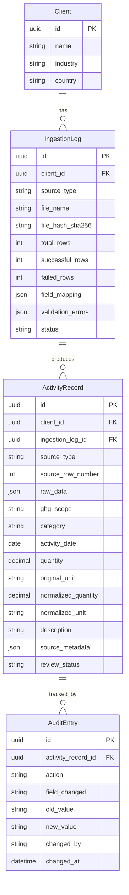

# Data Model

The Breathe ESG ingestion platform centers around normalising heterogeneous source data (SAP procurement, Utility portal exports, Concur JSON) into a unified `ActivityRecord` structure.

## Entity Relationship Diagram

## Core Entities

### ActivityRecord
The central normalized entity. Regardless of the source format, the parsed data is projected into this shape.
- `raw_data`: (JSON) Stores the verbatim dictionary of the original parsed row. Ensures no source data is ever lost, essential for auditability.
- `source_metadata`: (JSON) Stores structured source-specific context that doesn't fit standard columns (e.g., SAP plant codes, Concur airport codes, Utility meter IDs).
- **Dual Units**: We store both the `quantity`/`original_unit` (e.g. `12.5`, `TO`) and the `normalized_quantity`/`normalized_unit` (e.g. `12500.0`, `kg`). This preserves fidelity while allowing standard aggregations.

### IngestionLog
Tracks the lifecycle of a file upload.
- Stores per-row validation errors in `validation_errors`.
- Prevents duplicate processing via `file_hash_sha256`.

### AuditEntry
Provides an immutable ledger of every state change (creation, approval, rejection) on an `ActivityRecord`.

### Multi-Tenancy Strategy
We use **column-based multi-tenancy** (`client_id` foreign key on all core models) instead of schema-based or database-based isolation.
- **Why**: It is the simplest and most robust approach for a prototype/MVP scale, natively supported by Django's ORM via queryset filtering (`ActivityRecord.objects.filter(client=request.user.client)`).
